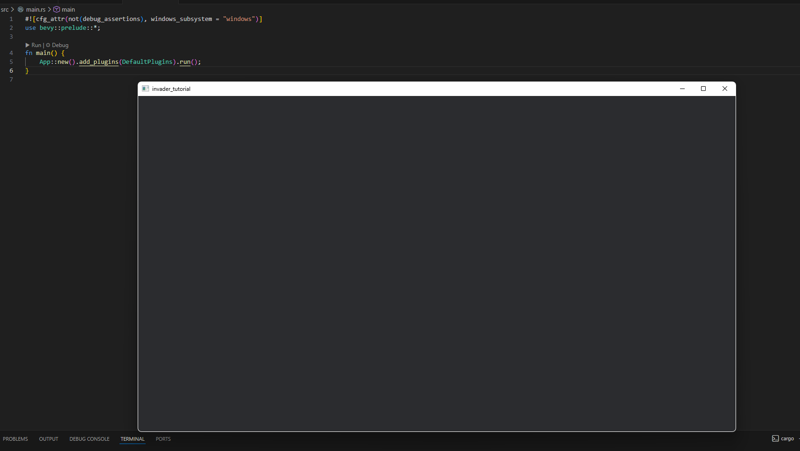

# Appの作成

`main.rs` を以下のように書き換えます。

```rust
#![cfg_attr(not(debug_assertions), windows_subsystem = "windows")]
use bevy::prelude::*;

fn main() {
    App::new().add_plugins(DefaultPlugins).run();
}
```
各行の役割を解説します。

- **1行目**: リリースビルド時にコンソールウィンドウを表示させないための設定です。
- **2行目**: Bevyで頻繁に使用する機能をまとめた「プレリュード（prelude）」をインポートしています。

- **main関数**: プログラムのエントリーポイントです。`App::new()` でアプリケーションを初期化し、`run()` でゲームループを開始します。
- **add_plugins(DefaultPlugins)**: ウィンドウ表示、キー入力、アセット管理など、ゲームに必要な基本機能をまとめて追加します。

この状態で `cargo run` を実行すると、空のウィンドウが表示されます。
（※`cargo run` は、ビルドを行ってから生成されたバイナリを実行するコマンドです。）

